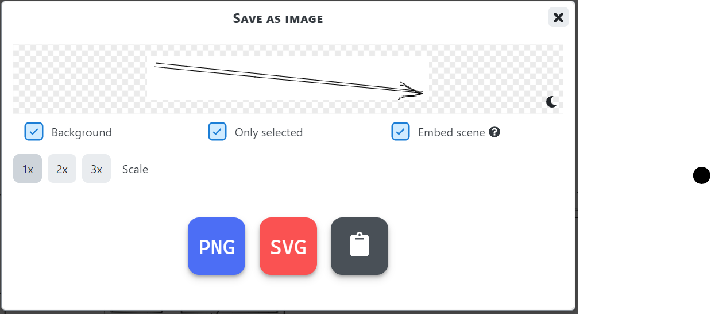

# OpenFeature Contributing

## Running locally

### Installation Prerequisites

You will need [Node.js](https://nodejs.org/en/download) installed.
Node.js >= 16.10 comes with `corepack` which can be used to access `yarn`.
Instructions for using yarn on all versions of node can be found [here](https://yarnpkg.com/getting-started/install).

### Installation

```sh
yarn
```

### Local Development

```sh
yarn start
```

This command starts a local development server and opens up a browser window. Most changes are reflected live without having to restart the server.

### Build

```sh
yarn build
```

This command generates static content into the `build` directory and can be served using any static contents hosting service.

### Deployment

The documentation is hosted by Netlify and deployments are automatically triggered after a successful merge to main.

## Pull Request

All contributions to the OpenFeature project are welcome via GitHub pull requests.

To create a new PR, you will need to first fork the GitHub repository and clone upstream.

```bash
git clone https://github.com/open-feature/openfeature.dev.git openfeature.dev
```

Navigate to the repository folder

```bash
cd openfeature.dev
```

Add your fork as an origin

```bash
git remote add fork https://github.com/YOUR_GITHUB_USERNAME/openfeature.dev.git
```

Makes sure your environment is all setup by starting the website

```bash
yarn
yarn start
```

To start working on a new feature or bugfix, create a new branch and start working on it.

```bash
git checkout -b feat/NAME_OF_FEATURE
# Make your changes
git add --all
git commit --signoff
git push fork feat/NAME_OF_FEATURE
```

Open a pull request against the main openfeature.dev repository.

### How to Receive Comments

- If the PR is not ready for review, please mark it as
  [`draft`](https://github.blog/2019-02-14-introducing-draft-pull-requests/).
- Make sure all required CI checks are clear.
- Submit small, focused PRs addressing a single concern/issue.
- Make sure the PR title reflects the contribution.
- Write a summary that helps understand the change.
- Include usage examples in the summary, where applicable.

### How to Get PRs Merged

A PR is considered to be **ready to merge** when:

- Major feedback is resolved.
- Urgent fix can take exception as long as it has been actively communicated.

Any Maintainer can merge the PR once it is **ready to merge**. Note, that some
PRs may not be merged immediately if the repo is in the process of a release and
the maintainers decided to defer the PR to the next release train.

If a PR has been stuck (e.g. there are lots of debates and people couldn't agree
on each other), the owner should try to get people aligned by:

- Consolidating the perspectives and putting a summary in the PR. It is
  recommended to add a link into the PR description, which points to a comment
  with a summary in the PR conversation.
- Tagging domain experts (by looking at the change history) in the PR asking
  for suggestion.
- Reaching out to more people on the [CNCF OpenFeature Slack channel](https://cloud-native.slack.com/archives/C0344AANLA1).
- Stepping back to see if it makes sense to narrow down the scope of the PR or
  split it up.

## Style Guide

### Diagrams

When adding a diagram to the documentation, it's recommended to use one of the following tools:

#### Mermaid

[Mermaid](https://mermaid-js.github.io/) is uses a Markdown-inspired text definitions to create diagrams. These diagrams are natively supported in GitHub and Docusaurus.

#### Excalidraw

[Excalidraw](https://excalidraw.com/) is a virtual whiteboard for sketching hand-drawn like diagrams. When saving an Excalidraw image, make sure to use the "embed scene" option. That will allow others to edit the image in the future.



