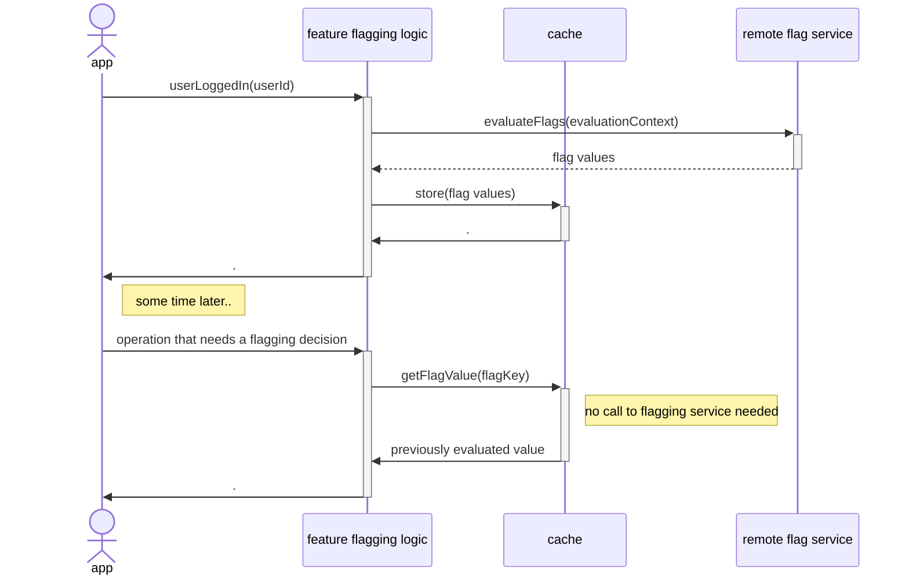
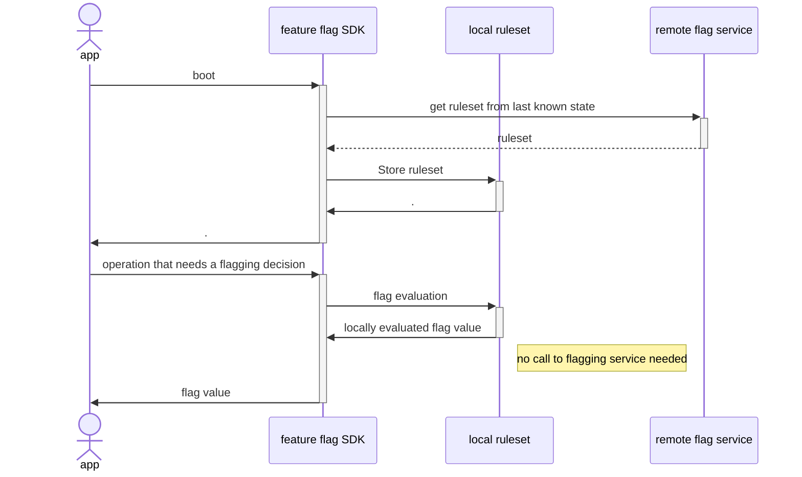
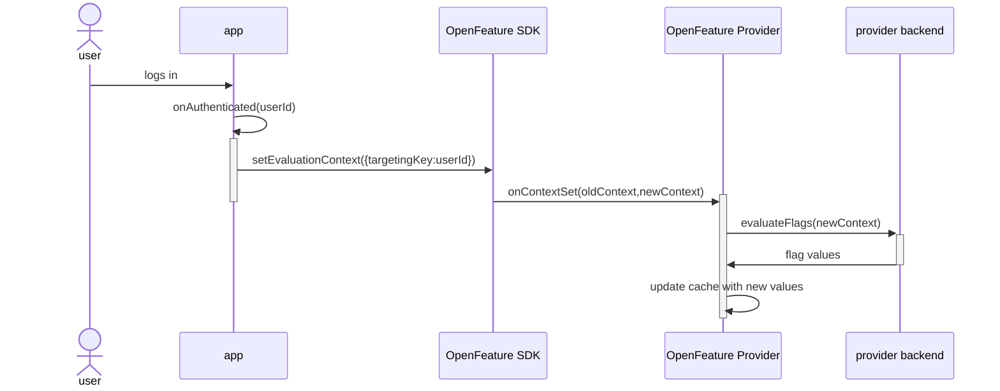

While OpenFeature initially focused on support for server-side feature flagging, we know that a lot of feature-flagging (likely the majority) happens on the client - mobile apps and frontend web apps. As such, we're currently finalizing [a proposal](https://github.com/open-feature/spec/issues/167) which extends the OpenFeature spec to support client-side use cases.
By the way, if you're working on a feature flagging framework, whether it's commercial, open-source, or internal product, the folks at OpenFeature would love to [hear more](https://forms.gle/TD4gAYKNgPiiwPrd6) about how you approach client-side flagging.

In this post I'll summarize those changes, but to understand them in context we'll first talk about what makes client-side feature flagging different before diving into how that will impact the OpenFeature APIs.

<!--truncate-->

## Context is King: why client-side flagging is different

### Static evaluation context

The key distinction between the client- and server-side feature flagging is the difference in how often evaluation context changes. In the typical server-side scenario - a service responding to http requests - the context for a feature flagging decision might change completely with every incoming request. Each new request is coming from a new user, and a lot of the evaluation context which affects a feature flagging decision is based on the user making the request.

In contrast, with a client-side app all feature flagging decisions are made in the context of the same user - the user interacting with the client-side app - and so the evaluation context is relatively static. There are cases where evaluation context will change within a client-side app - when a user logs in, for example - but by and large with client-side code we can treat feature flag evaluation context as something that is fixed (while still providing mechanisms to update it).

### The network is slow

With server-side flags, we can assume that evaluating a feature flag is a _relatively_ fast operation. With some systems the flagging rulesets[^1] live right next to where a flagging decision is needed, with flag evaluation happening either within the same process or in some sort of sidecar process. In this _local evaluation_ model every flagging decision is a very fast operation. For frameworks that use a _remote evaluation_ model, a flagging decision is still just a quick service call - akin to making a DB query or calling a remote cache.

[^1]: by "rulesets" I mean the set of feature flagging rule configurations that define how flagging decisions should be made for each feature flag: "enable red_checkout_button flag for 50% of users", "only enable new_reco_algorithm for users in the 'internal_testers' group", etc. Rulesets plus evaluation context are the two inputs that fully define the output for any flagging decision.

This situation is quite different with client-side flags. Remote flag evaluation now requires a trip across the internet, and we have to anticipate such a service call to be slow, particularly if our users are behind a spotty internet connection. In fact, with a native mobile app we have to handle a fully disconnected client. Even with the local evaluation model, we still have to deal with the fact that the source of truth for our flagging ruleset is on the other side of a potentially high-latency network.

### Eager evaluation for remote-evaluated systems

We can see that the network presents challenges for client-side apps using a remote evaluation model for flagging decisions. But we've also seen that the inputs into that flag evaluation - the evaluation context - are fairly static for client-side apps, and that means the _results_ of flag evaluation are fairly static too.

How do we handle an expensive operation with fairly static results? We add caching! And that's what many client-side feature flagging frameworks do.

Specifically, when the app starts the flagging framework requests an eager evaluation of all the feature flagging decisions that might be needed, and then caches those decisions. Then whenever client-side code needs to make a flagging decision the framework simply returns the pre-evaluated result from its local cache.



Put another way, with client-side feature flagging we can separate flag [**evaluation**](/specification/glossary#evaluating-flag-values) - passing an evaluation context through a set of rules in order to determine a flagging decision - from flag [**resolution**](/specification/glossary#resolving-flag-values) - getting the flagging decision for a specific feature flag.

### Keeping rulesets in sync for local-evaluated systems

Flagging frameworks that use a local evaluation model don't have to contend with network calls for every evaluation, but they still need to keep their local rulesets up to date and allow the client-side app to respond to changes in those ruleset. Again, this means using caches to keep the most recent ruleset available. It also means that the flagging framework may have an eventing or callback mechanism to inform application code that the ruleset has changed and that current flag values may be stale.



## Client-side support in OpenFeature

With OpenFeature we have been thinking about how to support these key differences between client-side and server-side feature flagging. We have come to refer to these differences as two _paradigms_: dynamic context (for server-side flags) and static context (for client-side flags).

OpenFeature's current Evaluation API supports the dynamic paradigm quite nicely, but to support the static paradigm (and thus client-side flagging) we need to add a second flavor of the Evaluation API.

### Server-side evaluation today

Let's compare and contrast. A typical server-side flagging decision using OpenFeature's current SDK might look something like this:

```java
@GetMapping("/hello")
public String getSalutation() {
    final Client client = openFeatureAPI.getClient();
    final evalContext:EvaluationContext = evalContextForCurrentRequest();

    if (client.getBooleanValue("use-formal-salutation", false, evalContext)) {
      return "Good day to you!";
    }else{
      return "Hey, what's up?";
    }
}
```

You can see that we're passing evaluation context every time we need to make a flagging decision.

### Client-side evaluation tomorrow

With the currently proposed OpenFeature changes, a client-side flagging decision would look more like this:

```java
public string generateSalutation(){
  if (client.getBooleanValue("use-formal-salutation", false)) {
    return "Good day to you!";
  }else{
    return "Hey, what's up?";
  }
}
```

Note that we are no longer passing evaluation context when requesting a flagging decision.

However OpenFeature does still need to take evaluation context into account, and our app still needs to make sure that OpenFeature has an accurate view of the current context. What does that look like?

We can imagine a client-side app where the evaluation context only changes when a user logs in or out. Let's say this app has an `onAuthenticated(...)` handler which fires whenever that happens. We can use that handler to make sure that the evaluation context used for subsequent feature flagging decision is up-to-date:

```java
// called whenever a user logs in (or out)
public void onAuthenticated(userId:String){
  OpenFeatureAPI api = OpenFeatureAPI.getInstance();
  api.setEvaluationContext(new MutableContext().add("targetingKey", userId));
}
```

This call to update the evaluation context can prompt OpenFeature's underlying flagging provider to update any cached feature flag values using the new evaluation context. The provider will be notified that the evaluation context has changed via a new `onContextSet` handler which is being added to the OpenFeature provider interface:

```java
class MyFlaggingProvider implements Provider {
  // triggered when `setEvaluationContext` is called
  onContextSet(EvaluationContext oldContext, EvaluationContext newContext): void {
    // here the provider can re-evaluate flags using the next evaluation context, updating any
    // previously cached flag values
  }
  //...
}
```



### Javascript niceties

JavaScript is the most common runtime for client-side flagging, and it comes with some peculiarities which we wanted to accommodate as we designed the OpenFeature API.

In order to align the OpenFeature API with most existing feature flagging providers and to play nicely with frontend frameworks, the static context flavor of the JavaScript Evaluation API will be a synchronous call:

```javascript
function Salutation() {
  const useFormalSalutation = client.getBooleanValue('use-formal-salutation', false);
  if (useFormalSalutation) {
    return <blink>Good day!</blink>;
  } else {
    return <blink>What's up!</blink>;
  }
}
```

contrast this with how a server-side flagging decision would be implemented, using the dynamic context flavor of the Evaluation API:

```javascript
const client = OpenFeature.getClient();

app.get('/hello', async (req, res) => {
  const evalContext = evaluationContextForRequest(req);
  const formalSalutation = await client.getBooleanValue('use-formal-salutation', false, evalContext);
  if (formalSalutation) {
    res.send('Good day!');
  } else {
    res.send("What's up!");
  }
});
```

Note that `getBooleanValue` is async - it returns a promise. That's pretty much unavoidable. This dynamic flavor of the evaluation API expects a different evaluation context every time it's called, and that means it can't be synchronous, because some feature flagging implementations will need to use asynchronous mechanisms such as networks calls in order to perform a flag evaluation with that new context.

However in the earlier client-side example we are in the static context paradigm which means that the evaluation context has been provided ahead of time, so we can pretty safely assume that the flagging decision can be made synchronously by pulling from a local cache.

### Non-authoritative results

This synchronous API also lines up better with the way rendering works in client-side web frameworks like React and Vue - via a synchronous call. However, with a synchronous API we have a potential for a race condition. What happens if our rendering logic asks for a flagging decision before a pre-evaluation operation has completed? We can't block, and so will have to return some sort of non-authoritative decision - a default value, or a previously evaluated value, or perhaps a null value.

```javascript
client.setContext(updatedEvalContext);

// this result will NOT be based on the evaluation context we
// provided immediately above - our feature flagging framework
// won't have had a chance to actually send this new context
// anywhere
const result = client.getBooleanValue('some-flag', true);
```

This potential for stale or non-authoritative results is the price we pay for using a synchronous API.

When we have received a non-authoritative answer we can pass it on to our rendering logic, but we also need some way to know when an authoritative value is available, so that we can trigger a re-render using that new value. OpenFeature will provide a mechanism for that in the form of Provider Events. Here's how you might use provider events as part of a React hook:

```javascript
client.addHandler(ProviderEvents.FlagValuesChanged, () => {
  // this would trigger a re-render
  setUseFormalSalutation(client.getBooleanValue('use-formal-salutation', false));
});
```

### A multi-paradigm SDK

To recap, OpenFeature is planning to support client-side feature flagging by introducing the concept of two flagging paradigms: dynamic context (for server-side flagging) and static context (for client-side flagging). The OpenFeature APIs will have two slightly different flavors, depending upon which paradigm they support.

This raises a question around distribution - how will we distribute these two flavors of API for languages such as JavaScript and Java which support both paradigms. Our intention in those situations is to distribute two distinct packages - for example with JavaScript we will likely have a `@openfeature/server-sdk` package and a `@openfeature/web-sdk` package. We are opting for this approach rather that distributing a single "universal", multi-paradigm package contain both APIs because we think this will be less confusing for developers getting started with OpenFeature. But under the covers the two OpenFeature packages will share a lot of common code.

If a feature flagging provider wants to provide support for both paradigms they will need to provide two distinct implementations of the [Provider API](/specification/sections/providers). These implementations could be shipped as part of a "universal" multi-paradigm, or as separate packages - that's a choice for a provider to make.

## In summary

We've seen that the difference between feature flagging on the client vs on the server comes down to the difference between two paradigms of evaluation context - static context and dynamic context, respectively. These two paradigms are different enough that they warrant two different flavors of API within OpenFeature, with the primary difference between whether highly-dynamic evaluation context is provided to the flagging framework at the point a flagging decision is requested, or whether mostly-static evaluation context is updated out-of-band when it changes, and ahead of the time when flagging decisions being made.

Getting better support in OpenFeature for client-side flags comes down to supporting both of these paradigms, and when you lay it all out adding that support doesn't have too huge an impact on the OpenFeature API. As we just discussed, it means adding a different flavor of the Evaluation API. In addition a few extra points of contact are added to the API surface so an app can tell the framework that the evaluation context has changed, and so the framework can in turn tell the app once new flag values are available.

With these additions in place, OpenFeature should have everything needed to bring client-side apps an open, vendor-agnostic standard for feature flagging.

## Revisions

Initially published **February 13 2023**.

- Updated **February 18 2023** to include discussion of local vs remote flag evaluation models.
- Updated **May 3 2024** to update the NPM package names.
