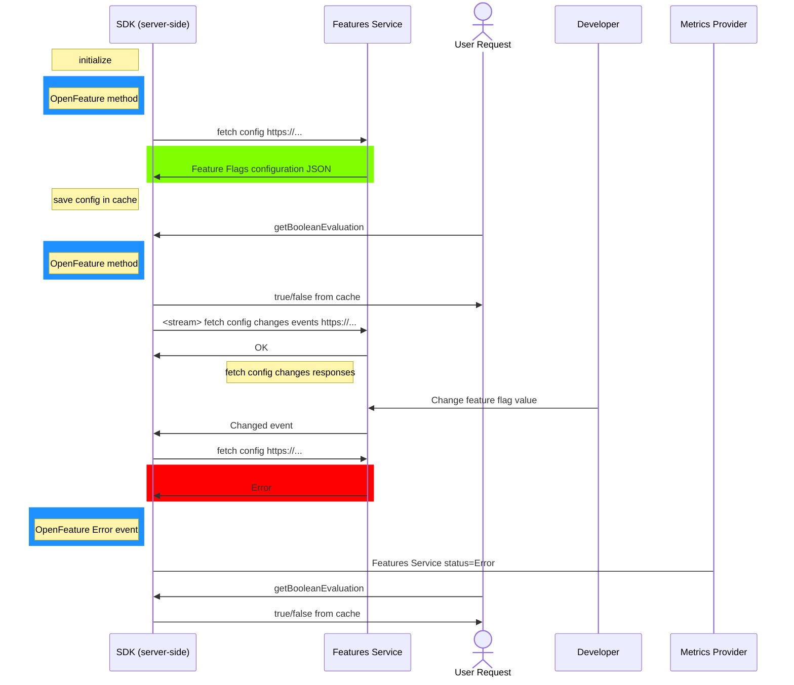

Our team recently needed to use one of the largest feature management cloud services.
This service has a documented SDK with usage guidelines.
Thinking about how to define the exposed interfaces, while keeping it simple and generic, I started doing some research, and encountered [OpenFeature](https://openfeature.dev).
Gladly, the mentioned feature management cloud service has already created an OpenFeature provider.
Let me explain why and how it was adopted.

<!--truncate-->

## Why Feature Management was needed

Our product needed a solution for feature flags:
* providing a gradual release mechanism and a simple way to define target audiences such as target group or split release
* Using feature flags for dynamic configuration values which can be changed in runtime dynamically without needing for a new release deployment.
* Ability for A/B testing - can be done via feature for specific region, specific users, etc.

## Why OpenFeature was chosen

While keeping it simple and generic, we had a few considerations:
* How to name the method ?
* How to do provide information for error handling ?
* What response structure to define ?
* How to define properties passed to the methods ?

OpenFeature solved me all these questions with its standard. When using a standard, I have good reasons why it is defined like this, as the standard supports it.

## Feature Management Cloud Service Provider Implementation For OpenFeature
Although the provider implementation is used transparantly, as it is open sourced, I explored its implementation.  
What I saw is that the provider implementation is very short and simple, acting like a "bridge" from OpenFeature to the feature management cloud service specific vendor SDK which was already exist.  
This can tell me that the OpenFeature standard is making sense.

## How OpenFeature was adopted
As for this context OpenFeature can be treated as a "bridge", it was used accordingly:
* OpenFeature provider initializer was added.
* Generic OpenFeature client wrapper was created.

## Monitoring
As our provider was fetching feature flags configuration and receiving real-time configuration changes, we needed to know its status and provide an alert on scenarios like service is down or communication failure.  
When adoption was done, OpenFeature did not support that functionallity.  
Open Feature lately added [Events](https://github.com/open-feature/spec/blob/main/specification/sections/05-events.md#5-events). Together with provider events implementation, it could have given us this functionallity.  
To overcome the missing events enhancement, we implemented it directly via provider abilities. It did cause some mix between OpenFeature and vendor specific implementation.

## Initialization
A common action is provider initialization. As it was vendor specific, it was done by provider call implementation.  
Open Feature lately added [Initialization](https://github.com/open-feature/spec/blob/main/specification/sections/02-providers.md#24-initialization) to the spec. This could have make it more standard implementation.

## Fetching flags
We used an option for fetching all enabled flags from the feature management service. This was not included at OpenFeature at the time, see example at [Flag Retrieval discussion](https://github.com/open-feature/ofep/issues/13#issuecomment-1337889563).

## SDK used functionalities
OpenFeature SDK has several used functionalities. What used for our case:
* Evaluation via OpenFeature Client (getBooleanEvaluation with context and similarly for other types)
* Initialization - see [Initialization](#initialization)
* Events - see [Monitoring](#monitoring)
* Fetch all flags - see [Fetching flags](#fetching-flags)

###  Features Management SDK - example flow



## Summary

### High Level Adoption
* Main functionallity used is for evaluating a feature flag value, which fitted our needs.
* Adopting OpenFeature flag required adding OpenFeature SDK dependency and using it.  
  As no other major extra steps were needed, it is done via the adoption without containers related changes.

### Challenges
Some thoughts raised during the adoption:
* Feature Flags Configuration  
  Considering this as the provider configuration of feature flags, e.g.  
  ```
  feature1=enabled
  feature2=enabled by 50% split
  feature3=disabled
  feature4=enabled by customerId=4
  ```  
  This configuration can be represented as a scheme.  
  I was thinking whether this configuration to be part of the standard. If so, it might be beneficial for import/export configurations accross vendors.
  See [Slack discussion](https://cloud-native.slack.com/archives/C0344AANLA1/p1684776996586969?thread_ts=1684774617.486109&cid=C0344AANLA1) and example [flagd-definitions](https://github.com/open-feature/schemas/blob/main/json/flagd-definitions.json).
* Events - see [Monitoring](#monitoring)
* Fetch all flags - see [Fetching flags](#fetching-flags)
* Flags registration  
  Some providers exposing initial flags registration via their SDK. Wondering how does it go with OpenFeature spec.

