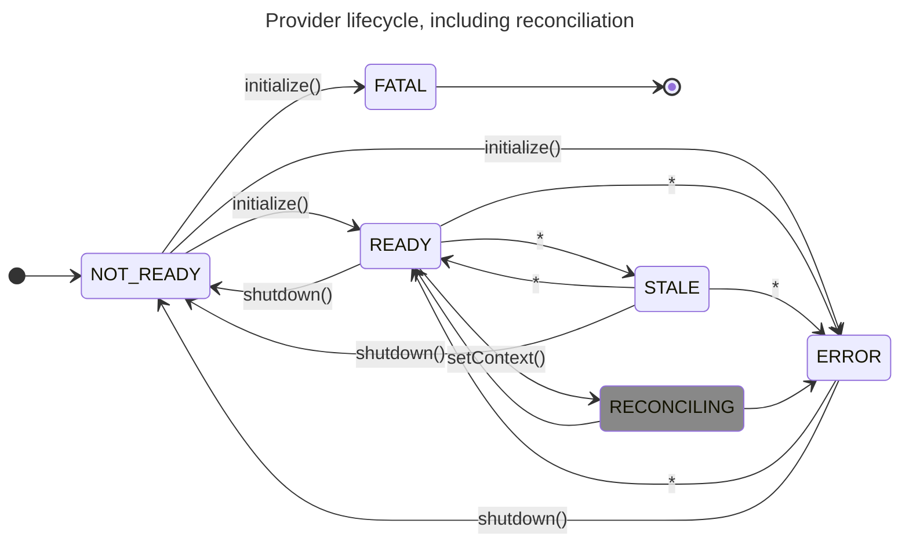

## Recent Specification Changes 🗒

There's no shortage of frameworks available when it comes to the development of enterprise software.
Whether it's the "frontend" or "backend", developers are quick to avail things like React, Spring, Gin and Flask to avoid boilerplate code and structure their applications in a familiar way.
Such frameworks also offer convenient abstractions that ease the employment of common patterns, think _dependency injection_ as in Angular or Spring, or _MVC_ as in Django or ASP.NET MVC.
Many also provide extensibility features so that new functionality can be implemented seamlessly and idiomatically.

OpenFeature, we've been working on [enhancing our specification](https://github.com/open-feature/spec/pull/241) and base SDKs to support the creation of such _framework-level_ SDKs in order to bring vendor neutral feature flags to them.
Specifically with respect to front end frameworks such as React, we've found that it was critical to refine the semantics of our events API and context-reconciliation concepts.
This post discusses some of our improvements.

### Context Reconciliation

As discussed in [previous blog posts](https://openfeature.dev/blog/catering-to-the-client-side), we've seen that client-side feature flag APIs share some commonalities we refer to collectively as the [static-context paradigm](https://openfeature.dev/specification/glossary/#static-context-paradigm); in short, the context used as the basis for flag evaluation is less frequently changed and generally corresponds to a user, or application state that a user occasionally modifies.
When a user logs in, or some state is modified, [providers](https://openfeature.dev/specification/glossary#provider) frequently need to fetch a new ruleset or re-evaluate their cache of flags based on the new contextual data.
We refer to this as _reconciliation_.
During reconciliation, some asynchronous work is often required (frequently this takes form of some kind of network request).
During this time, depending on the provider and the needs of the application, it might be necessary to display loading indicators, or prevent users from taking action.
Some frameworks have patterns or in-built functionality to support this, such as React's [suspense](https://react.dev/reference/react/Suspense).
In order to leverage such features, we've added a new `RECONCILING` provider state and `PROVIDER_RECONCILING` provider event.
These indicate the provider is in the process of reconciling it's internal state due to a context change.
Previously, something like this was achievable with the use of the STALE state and events, but we believed this was overloading the meaning of this state and didn't provide adequately robust semantics.

\* transitions occurring when associated events are spontaneously emitted from the provider

### Wider Implications: "Stateless" Providers

Up to now, providers maintained a publicly-exposed representation of their own state: when they became ready, they changed their state to `READY`; if they lost connection to their source of truth, they might change their state to `STALE` or `ERROR` and emit `PROVIDER_STALE` or `PROVIDER_ERROR` events.
This state management was burdensome for provider authors, and the addition of new states (such as `RECONCILING` mentioned above) only worsened that issue.
Additionally, it allowed for widely divergent behavior between provider implementations, making the creation of framework-specific SDKs difficult and their behavior less predictable between providers, without meaningful benefit.
With this update, _the provider interface has become stateless_.
Now, the SDK itself maintains the provider's state based on the completion of lifecycle functions (`initialization`, `shutdown`, `on context change`) and events emitted by the provider.
This simplifies things for provider authors, and results in a uniform experience for application authors, especially when leveraging framework-specific SDKs.

### Bad States

In some circumstances, providers may not be able to evaluate flags.
This could be because a provider hasn't yet been fully initialized, or has experienced some internal error.
Previously, provider-authors had to ensure their publicly exposed state was updated if such errors occurred, as well as emit an error event.
Furthermore, provider authors had to check with this state to accurately return an informative `error code` (ie: `PROVIDER_NOT_READY`) if evaluation was attempted in such states.
With these recent changes, we've added a new `FATAL` error code, indicating that the provider has entered a irrecoverable error state (typically due to a bad credential, hostname or other value that's likely to represent a misconfiguration).
Along with this helpful new state, implementations will now "short-circuit" evaluations if the provider is in `NOT_READY` or `FATAL` states.

Overall, we believe these changes will improve consistency for application authors across providers, and simultaneously reduce the burden on provider authors as well.

## Contributing 🤝

If you're interested in contributing, there's no shortage of opportunities!
You can create a client-side provider for a vendor or tool you're familiar with and host in our [contrib repos](https://github.com/orgs/open-feature/repositories?q=contrib).
If the server-side is more your thing, you can help to update any of our existing server-side providers by simplifying them consistent with this latest spec change.
As always, we're looking for help with our newest SDKs, some of which have yet to reach 1.0, including [Kotlin](https://github.com/open-feature/kotlin-sdk), [Swift](https://github.com/open-feature/swift-sdk), [Python](https://github.com/open-feature/python-sdk), [Ruby](https://github.com/open-feature/ruby-sdk), and [Rust](https://github.com/open-feature/rust-sdk).
We're also interested in more framework-specific SDKs as discussed in this earlier post.
If there's a framework or library you think could benefit from an OpenFeature SDK, these are a great idea for a first contribution.

## Shout Outs 🥇

Thanks to everyone who worked on this specification change, and a special shout-out to the folks at Spotify who've been contributing to the spec, as well as to our client implementations including our Kotlin and Swift SDKs.

## Stay Tuned... 📻

We're excited to be working on an open, vendor-neutral protocol for the evaluation of feature flags, which adheres to OpenFeature semantics.
This protocol could be used as the basis for a single provider which is compatible with any implementing backend, and might be of particular usefulness for client-side feature flagging. 
If you'd like to know more, check out our [dedicated slack channel](https://cloud-native.slack.com/archives/C066A48LK35) for this topic.
