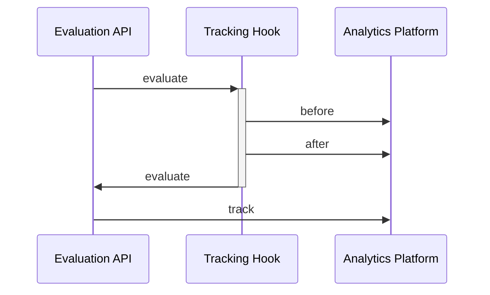

# Tracking

import Tabs from '@theme/Tabs';
import TabItem from '@theme/TabItem';

Tracking, as it relates to an OpenFeature provider, is the concept of associating a metric or KPI with the evaluation context of a feature flag. 
This association can be relevant to the measurement of changes to application performance, whether in the context of business KPIs or system performance. 
Tracking functionality is primarily important to the process of experimentation.


## Experimentation, in Brief

Tracking functionality is essential for measuring outcomes and conducting robust experimentation with feature flags.
It "closes the gap" between flag evaluations and key KPIs such as conversions or time spent.
For example, a feature flag controlling the order of items in a menu may lead to increased usage of items earlier in the list.
Such a flag can be associated with `track` events emitted when a menu item is clicked.
Finally, since the contextual information of the flag evaluation and track event contain common properties (such as user identifiers), metrics can be derived to validate this assumption.

## Providers, Hooks and Integration

In order to accomplish the experimentation above, it's required that the flag provider in use reports events or metrics about the flag evaluations and [tracking calls](/specification/sections/providers/#27-tracking-support) it facilitates.
If your vendor or home-grown solution does not support these functionalities, the OpenFeature SDK offers various integration and extension points to help.
You can implement your own provider [track](/specification/sections/tracking#61-tracking-api) function (by extending or encapsulating your provider) and use custom [hooks](04-hooks.mdx), to collect and export the appropriate event data to your customer data or analytics platform.



## Track Event
When using the `track` function with your OpenFeature provider the only required field is a label. 
You will not need to pass in an identifier or the context of the flags that are being evaluated, given the OpenFeature provider already holds this context. 

If desired, or if your feature flagging tool of choice supports it, you can optionally associate a map of additional metadata with each track event.


<Tabs groupId="code">
<TabItem value="js" label="TypeScript">

```ts
// flag is evaluated
client.getBooleanValue('new-feature', false);

// anywhere else in your application a relevant KPI can be tracked
client.track('conversion-tracked');

// optionally additional data can be associated with the event
client.track('conversion-tracked', {"value":99.77, "currencyCode":"USD"});
```

</TabItem>
</Tabs>