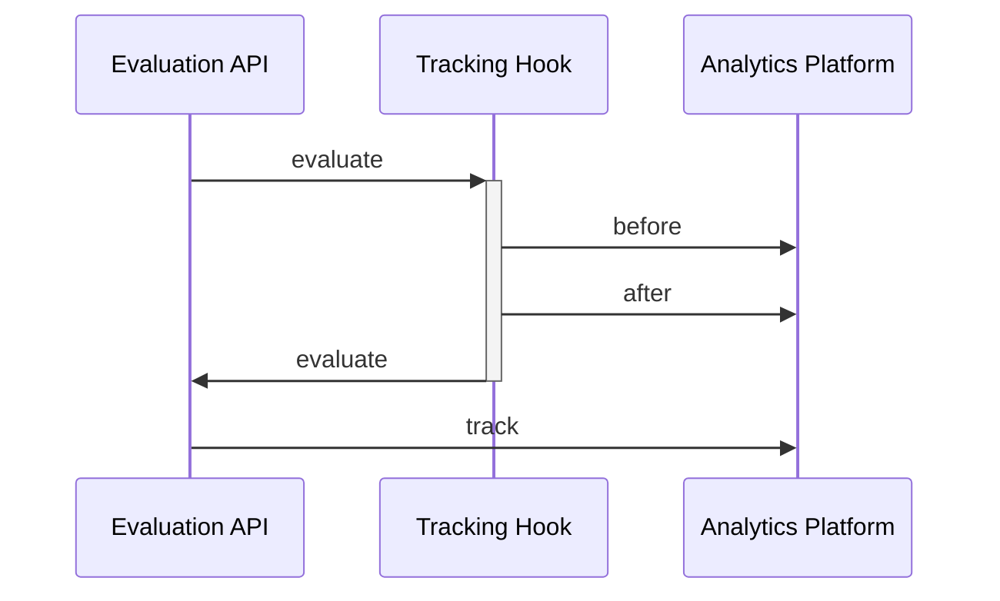

# Tracking

import Tabs from '@theme/Tabs';
import TabItem from '@theme/TabItem';

Tracking in OpenFeature is the process of associating metrics or KPIs with feature flag evaluation contexts. 
This association helps measure the impact of feature changes on both business KPIs and system performance, making it particularly valuable for experimentation.


## Use Cases

Tracking events associated with flag evaluations serves two primary purposes:

### Performance Monitoring

When changes are made to an application via feature flags, tracking helps measure their impact on performance. By associating events with flag evaluation contexts 
and sending this data to telemetry or analytics platforms, teams can determine whether specific flag configurations improve or degrade measured performance, 
whether business metrics or system performance.

### Experimentation

Tracking creates a crucial link between flag evaluations and business outcomes, enabling robust experimentation. Experimentation differs from generalized 
Performance Monitoring in its execution. The most common form of Experimentation being A/B testing which is when two variations of an application or feature 
are distributed randomly to similar groups and the differences in metrics is evaluated. For example, if a feature flag controls the order 
of items in a menu, tracking events can be emitted when users click on menu items. The feature flag provider can typically be set to distribute the different variations 
equally to your audience, making this an A/B test, helping to validate hypotheses about user behavior in a statistically relevant manner.

## Providers, Hooks and Integration

In order to accomplish the use cases above, it's required that the flag provider in use reports events or metrics about the flag evaluations and [tracking calls](/specification/sections/providers/#27-tracking-support) it facilitates.
If your vendor or home-grown solution does not support these functionalities, the OpenFeature SDK offers various integration and extension points to help.
You can implement your own provider [track](/specification/sections/tracking#61-tracking-api) function (by extending or encapsulating your provider) and use custom [hooks](04-hooks.mdx), to collect and export the appropriate event data to your customer data or analytics platform.



## Track Event Implementation
The `track` function requires only a label parameter. You don’t need to pass an identifier or flag evaluation context since the OpenFeature provider already maintains this information.

Optionally, you can associate additional metadata with each track event if your feature flagging tool supports it.

<Tabs groupId="code">
<TabItem value="js" label="TypeScript">

```ts

// example tracking event recording a conversion
client.track('conversion-tracked');

// optionally additional data can be associated with the event
client.track('conversion-tracked', {
  "value": 99.77,
  "currencyCode":"USD"
});
```

</TabItem>

<TabItem value="java" label="Java">

```java

// example tracking event recording a conversion
client.track("conversion-tracked");

// optionally additional data can be associated with the event
client.track("conversion-tracked", new TrackingEventDetails(99.77).add("currencyCode", "USD"));

```

</TabItem>

</Tabs>