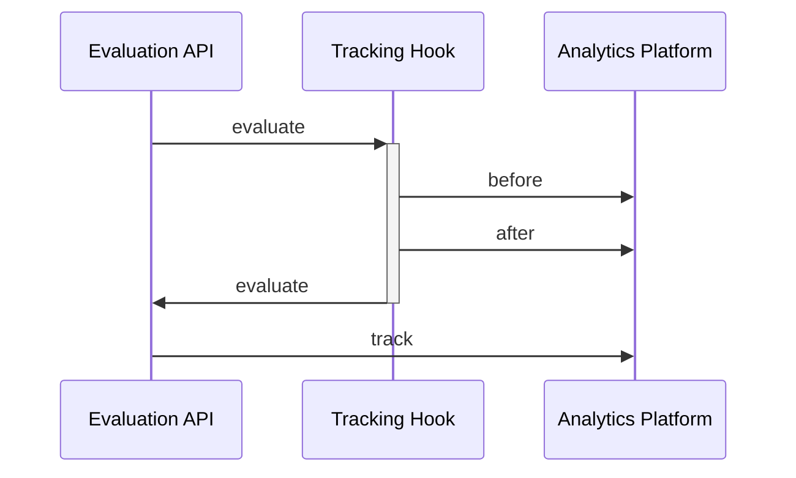

# Tracking

## Experimentation, in Brief

_Tracking_ functionality is essential for measuring outcomes and conducting robust experimentation with feature flags.
It "closes the gap" between flag evaluations and user actions, such as page visits.
For example, a feature flag controlling the order of items in a menu may lead to increased usage of items earlier in the list.
Such a flag can be associated with `track` events emitted when a menu item is clicked.
Finally, since the contextual information of the flag evaluation and track event contain common properties (such as user identifiers), metrics can be derived to validate this assumption.

## Providers, Hooks and Integration

In order to accomplish the experimentation above, it's required that the flag provider in use reports events or metrics about the flag evaluations and [tracking calls](/specification/sections/providers/#27-tracking-support) it facilitates.
If your vendor or home-grown solution does not support these functionalities, the OpenFeature SDK offers various integration and extension points to help.
You can implement your own provider [track](/specification/sections/tracking#61-tracking-api) function (by extending or encapsulating your provider) and use custom [hooks](04-hooks.mdx), to collect and export the appropriate event data to your customer data or analytics platform.

