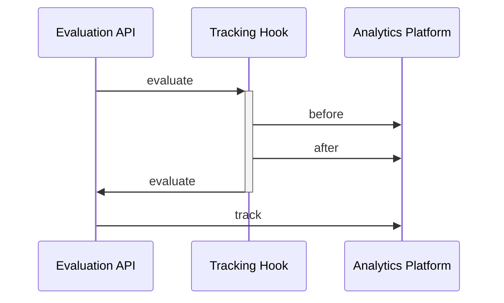

# Tracking

import Tabs from '@theme/Tabs';
import TabItem from '@theme/TabItem';

Tracking in OpenFeature is the process of associating metrics or KPIs with feature flag evaluation contexts.
This association helps measure the impact of feature changes on both business KPIs and system performance, making it particularly valuable for experimentation.

## Use Cases

Tracking events associated with flag evaluations serves two primary purposes:

### Performance Monitoring

When changes are made to an application via feature flags, tracking helps measure their impact on performance.
By associating events with flag evaluation contexts
and sending this data to telemetry or analytics platforms, teams can determine whether specific flag configurations improve or degrade measured performance,
whether business metrics or system performance.

### Experimentation

Tracking creates a crucial link between flag evaluations and business outcomes, enabling robust experimentation.
Experimentation differs from generalized
Performance Monitoring in its execution.
The most common form of Experimentation being A/B testing which is when two variations of an application or feature
are distributed randomly to similar groups and the differences in metrics is evaluated.
For example, if a feature flag controls the order
of items in a menu, tracking events can be emitted when users click on menu items.
The feature flag provider can typically be set to distribute the different variations
equally to your audience, making this an A/B test, helping to validate hypotheses about user behavior in a statistically relevant manner.

## Providers, Hooks and Integration

In order to accomplish the use cases above, it's required that the flag provider in use reports events or metrics about the flag evaluations and [tracking calls](/specification/sections/providers/#27-tracking-support) it facilitates.
If your vendor or home-grown solution does not support these functionalities, the OpenFeature SDK offers various integration and extension points to help.
You can implement your own provider [track](/specification/sections/tracking#61-tracking-api) function (by extending or encapsulating your provider) and use custom [hooks](04-hooks.mdx), to collect and export the appropriate event data to your customer data or analytics platform.


```mermaid
sequenceDiagram
  Evaluation API->>+Tracking Hook: evaluate
  Tracking Hook->>Analytics Platform: before
  Tracking Hook->>Analytics Platform: after
  Tracking Hook->>-Evaluation API: evaluate
  Evaluation API->>Analytics Platform: track
```

## Track Event Implementation

The `track` function requires only a label parameter.
You don’t need to pass an identifier or flag evaluation context since the OpenFeature provider already maintains this information.

Optionally, you can associate additional metadata with each track event if your feature flagging tool supports it.

<Tabs groupId="code">
<TabItem value="js" label="TypeScript">

```ts
// example tracking event recording a conversion
client.track('conversion-tracked');

// optionally additional data can be associated with the event
client.track('conversion-tracked', {
  value: 99.77,
  currencyCode: 'USD',
});
```

</TabItem>

<TabItem value="java" label="Java">

```java
// example tracking event recording a conversion
client.track("conversion-tracked");

// optionally additional data can be associated with the event
client.track("conversion-tracked", new TrackingEventDetails(99.77).add("currencyCode", "USD"));
```

</TabItem>

<TabItem value="csharp" label="C#">

```csharp
// example tracking event recording a conversion
client.Track("visited-promo-page");

// optionally additional data can be associated with the event
client.Track("visited-promo-page", new TrackingEventDetailsBuilder().SetValue(99.77).Set("currencyCode", "USD").Build());
```

</TabItem>
<TabItem value="go" label="Go">

```go
client.Track(
  context.Background(),
  "visited-promo-page",
  openfeature.EvaluationContext{},
  openfeature.NewTrackingEventDetails(99.77).Add("currencyCode", "USD"),
  )
```

</TabItem>

</Tabs>

## Experimentation-Focused Example
 
Here is a complete A/B testing flow using OpenFeature.
The pattern is: evaluate a flag to assign the user to a variant, show the corresponding experience, then call `track` when the conversion event occurs.
The provider automatically links the tracking event back to the flag evaluation context (including the `targetingKey`), so your analytics platform can segment results by variant.
 
<Tabs groupId="code">
<TabItem value="js" label="TypeScript">
```ts
import { OpenFeature } from '@openfeature/server-sdk';
 
// Set evaluation context with the user's targeting key.
// The targeting key is how your provider buckets users into variants consistently.
OpenFeature.setContext({
  targetingKey: 'user-123',
});
 
const client = OpenFeature.getClient();
 
// Evaluate the experiment flag — provider returns true (variant) or false (control)
const useNewCheckout = await client.getBooleanValue('checkout-experiment', false);
 
if (useNewCheckout) {
  // Show the new checkout UI (variant group)
  await showNewCheckout();
} else {
  // Show the existing checkout UI (control group)
  await showExistingCheckout();
}
 
// When the user completes the purchase, emit a tracking event.
// The provider associates this event with the flag evaluation context automatically.
client.track('checkout-completed', { value: 49.99, currencyCode: 'USD' });
```
 
</TabItem>
<TabItem value="java" label="Java">
```java
import dev.openfeature.sdk.*;
 
OpenFeatureAPI api = OpenFeatureAPI.getInstance();
 
// Set evaluation context with the user's targeting key
Map<String, Value> attrs = new HashMap<>();
EvaluationContext ctx = new ImmutableContext("user-123", attrs);
api.setEvaluationContext(ctx);
 
Client client = api.getClient();
 
// Evaluate the experiment flag
Boolean useNewCheckout = client.getBooleanValue("checkout-experiment", false);
 
if (useNewCheckout) {
    showNewCheckout();
} else {
    showExistingCheckout();
}
 
// Track the conversion event — provider links it back to the flag evaluation context
client.track("checkout-completed", new MutableTrackingEventDetails(49.99).add("currencyCode", "USD"));
```
 
</TabItem>
<TabItem value="csharp" label="C#">
```csharp
using OpenFeature;
using OpenFeature.Model;
 
// Set evaluation context with the user's targeting key
EvaluationContextBuilder builder = EvaluationContext.Builder();
builder.Set("targetingKey", "user-123");
EvaluationContext ctx = builder.Build();
Api.Instance.SetContext(ctx);
 
var client = Api.Instance.GetClient();
 
// Evaluate the experiment flag — all evaluations are async in .NET SDK, note GetBooleanValueAsync
var useNewCheckout = await client.GetBooleanValueAsync("checkout-experiment", false);
 
if (useNewCheckout) {
    await ShowNewCheckout();
} else {
    await ShowExistingCheckout();
}
 
// Track the conversion event
client.Track("checkout-completed", trackingEventDetails: new TrackingEventDetailsBuilder()
    .SetValue(49.99).Set("currencyCode", "USD").Build());
```
 
</TabItem>
<TabItem value="go" label="Go">
```go
import (
    "context"
    "github.com/open-feature/go-sdk/openfeature"
)
 
// Set evaluation context with the user's targeting key
openfeature.SetEvaluationContext(
    openfeature.NewEvaluationContext(
        "user-123",
        map[string]any{},
    ),
)
 
client := openfeature.NewClient("my-app")
 
// Evaluate the experiment flag
useNewCheckout, _ := client.BooleanValue(
    context.TODO(), "checkout-experiment", false, openfeature.EvaluationContext{},
)
 
if useNewCheckout {
    showNewCheckout()
} else {
    showExistingCheckout()
}
 
// Track the conversion event — provider links it back to the flag evaluation context
client.Track(
    context.TODO(),
    "checkout-completed",
    openfeature.EvaluationContext{},
    openfeature.NewTrackingEventDetails(49.99).Add("currencyCode", "USD"),
)
```
 
</TabItem>
</Tabs>

