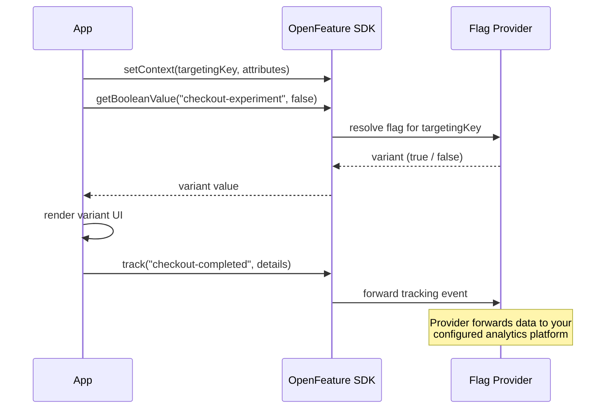

# Experimentation

import Tabs from '@theme/Tabs';
import TabItem from '@theme/TabItem';

OpenFeature provides built-in support for experimentation use cases such as A/B testing, multivariate tests, and gradual rollouts.
This page explains how three existing capabilities namely the tracking API, hooks, and targeting key, work together to support experimentation workflows.

## How OpenFeature Supports Experimentation

Three OpenFeature mechanisms combine to form a complete experimentation pipeline:

- **Tracking API** : Records business events (conversions, clicks, sign-ups) and links them back to the flag evaluation context so your analytics platform can measure per-variant outcomes.
- **Hooks** : Extend the SDK at well-defined points of the flag evaluation lifecycle to capture metrics and forward data to analytics platforms without modifying application code.
- **Targeting Key** : A stable user identifier (passed via evaluation context) that your provider uses to assign users to variants consistently across sessions, and that analytics platforms use as the join key between flag evaluations and tracking events.




## Experimentation Workflow

### Step 1 : Set the Evaluation Context

The `targetingKey` is the user identifier your provider uses to assign the user to a variant consistently across sessions.
Additional attributes (plan, geo, device) can be used by the provider for more advanced targeting rules.

<Tabs groupId="code">
<TabItem value="js" label="TypeScript">

```ts
import { OpenFeature } from '@openfeature/server-sdk';

// Set global context — targetingKey is the primary experiment identifier
OpenFeature.setContext({
  targetingKey: 'user-456',
  plan: 'premium',
  geo: 'EU',
});
```

</TabItem>

<TabItem value="java" label="Java">

```java
import dev.openfeature.sdk.*;
import java.util.HashMap;
import java.util.Map;

OpenFeatureAPI api = OpenFeatureAPI.getInstance();

// Build evaluation context with targeting key and attributes
Map<String, Value> attrs = new HashMap<>();
attrs.put("plan", new Value("premium"));
attrs.put("geo", new Value("EU"));
EvaluationContext ctx = new ImmutableContext("user-456", attrs);

api.setEvaluationContext(ctx);
```

</TabItem>

<TabItem value="csharp" label="C#">

```csharp
using OpenFeature;
using OpenFeature.Model;

// Build evaluation context with targeting key and attributes
EvaluationContextBuilder builder = EvaluationContext.Builder();
builder.Set("targetingKey", "user-456");
builder.Set("plan", "premium");
builder.Set("geo", "EU");
EvaluationContext ctx = builder.Build();

Api.Instance.SetContext(ctx);
```

</TabItem>

<TabItem value="go" label="Go">

```go
import "github.com/open-feature/go-sdk/openfeature"

// Set global context with targeting key and attributes
openfeature.SetEvaluationContext(
    openfeature.NewEvaluationContext(
        "user-456",
        map[string]any{
            "plan": "premium",
            "geo":  "EU",
        },
    ),
)
```

</TabItem>
</Tabs>

### Step 2 : Evaluate the Experiment Flag

Use the standard evaluation API to determine which variant the user receives.
The provider uses the `targetingKey` from the context to return a consistent variant for that user.

<Tabs groupId="code">
<TabItem value="js" label="TypeScript">

```ts
const client = OpenFeature.getClient();

// getBooleanValue: false = control group, true = variant group
const useNewCheckout = await client.getBooleanValue('checkout-experiment', false);

if (useNewCheckout) {
  renderNewCheckoutFlow();
} else {
  renderExistingCheckoutFlow();
}
```

</TabItem>

<TabItem value="java" label="Java">

```java
Client client = api.getClient();

// getBooleanValue: false = control, true = variant
Boolean useNewCheckout = client.getBooleanValue("checkout-experiment", false);

if (useNewCheckout) {
    renderNewCheckoutFlow();
} else {
    renderExistingCheckoutFlow();
}
```

</TabItem>

<TabItem value="csharp" label="C#">

```csharp
var client = Api.Instance.GetClient();

// GetBooleanValueAsync: false = control, true = variant
var useNewCheckout = await client.GetBooleanValueAsync("checkout-experiment", false);

if (useNewCheckout) {
    RenderNewCheckoutFlow();
} else {
    RenderExistingCheckoutFlow();
}
```

</TabItem>

<TabItem value="go" label="Go">

```go
client := openfeature.NewClient("my-app")

// BooleanValue: false = control, true = variant
useNewCheckout, _ := client.BooleanValue(
    context.TODO(), "checkout-experiment", false, openfeature.EvaluationContext{},
)

if useNewCheckout {
    renderNewCheckoutFlow()
} else {
    renderExistingCheckoutFlow()
}
```

</TabItem>
</Tabs>

### Step 3 : Track Conversions

Call `track` when a business event occurs (purchase, sign-up, click).
The provider automatically links this event to the flag evaluation context — including the `targetingKey` — so your analytics platform can segment conversion rates by variant.

<Tabs groupId="code">
<TabItem value="js" label="TypeScript">

```ts
// When the user completes a purchase, emit a tracking event
client.track('checkout-completed', { value: 29.99, currencyCode: 'USD' });
```

</TabItem>

<TabItem value="java" label="Java">

```java
// When the user completes a purchase, emit a tracking event
client.track("checkout-completed",
    new MutableTrackingEventDetails(29.99).add("currencyCode", "USD"));
```

</TabItem>

<TabItem value="csharp" label="C#">

```csharp
// When the user completes a purchase, emit a tracking event
client.Track("checkout-completed", trackingEventDetails: new TrackingEventDetailsBuilder()
    .SetValue(29.99).Set("currencyCode", "USD").Build());
```

</TabItem>

<TabItem value="go" label="Go">

```go
// When the user completes a purchase, emit a tracking event
client.Track(
    context.TODO(),
    "checkout-completed",
    openfeature.EvaluationContext{},
    openfeature.NewTrackingEventDetails(29.99).Add("currencyCode", "USD"),
)
```

</TabItem>
</Tabs>

### Step 4 : Analyze Results

Your analytics platform uses the `targetingKey` as the join key between flag evaluation data and tracking events.
This lets it compute per-variant conversion rates and determine statistical significance, so you can decide whether to roll out the winning variant.

## The Targeting Key

The `targetingKey` is the single most important field for experimentation. It serves three roles:

- **Consistent assignment** : The same user always receives the same variant as long as the flag configuration does not change.
- **Unbiased splits** : Providers use consistent hashing on the targeting key to distribute users evenly across variants.
- **Join key** : Analytics platforms join flag evaluation records with tracking events using this identifier.

Use a stable, unique user identifier as the targeting key — typically a user ID, session ID, or device ID.
