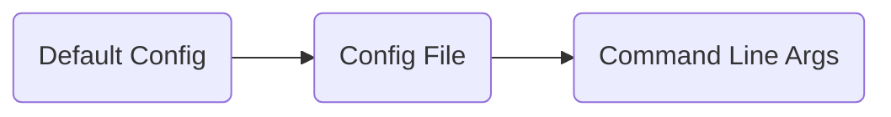

<p align="center" class="github-badges">
  <a href="https://github.com/orgs/open-feature/projects/17">
    
  </a>
  <a href="https://cloud-native.slack.com/archives/C07DY4TUDK6">
    
  </a>
</p>

The OpenFeature CLI is a command-line tool designed to improve the developer experience when working with feature flags.
It helps developers manage feature flags consistently across different environments and programming languages by providing powerful utilities for code generation, flag validation, and more.

The CLI bridges the gap between feature flag management systems and your application code by generating strongly typed flag accessors from a flag manifest. This approach provides:

- **Type Safety**: Generate strongly-typed flag accessors for your preferred language
- **Developer Experience**: Reduce errors and improve IDE autocomplete support
- **Language Support**: Generate code for TypeScript, JavaScript, React, Go, C#, and more

## Installation

### via curl

The OpenFeature CLI can be installed using a shell command.
This method is suitable for most Unix-like operating systems.

```bash
curl -fsSL https://openfeature.dev/scripts/install_cli.sh | sh
```

### via Docker

The OpenFeature CLI is available as a Docker image in the [GitHub Container Registry](https://github.com/open-feature/cli/pkgs/container/cli).

You can run the CLI in a Docker container using the following command:

```bash
docker run -it -v $(pwd):/local -w /local ghcr.io/open-feature/cli:latest
```

### via Go

If you have `Go >= 1.23` installed, you can install the CLI using the following command:

```bash
go install github.com/open-feature/cli/cmd/openfeature@latest
```

### via pre-built binaries

Download the appropriate pre-built binary from the [releases page](https://github.com/open-feature/cli/releases).

## Quick Start

1. Create a flag manifest file in your project root:

```bash
cat > flags.json << EOL
{
  "$schema": "https://raw.githubusercontent.com/open-feature/cli/refs/heads/main/schema/v0/flag-manifest.json",
  "flags": {
    "enableMagicButton": {
      "flagType": "boolean",
      "defaultValue": false,
      "description": "Activates a special button that enhances user interaction with magical, intuitive functionalities."
    }
  }
}
EOL
```

> [!NOTE]
> This is for demonstration purposes only.
> In a real-world scenario, you would typically want to fetch this file from a remote flag management service.
> See [here](https://github.com/open-feature/cli/issues/3), more details.

2. Generate code for your preferred language:

```bash
openfeature generate react
```

See [here](https://github.com/open-feature/cli/blob/docs-update-readme-for-website/docs/commands/openfeature_generate.md) for all available options.

3. View the generated code:

```bash
cat openfeature.ts
```

**Congratulations!**
You have successfully generated your first strongly typed flag accessors.
You can now use the generated code in your application to access the feature flags.
This is just scratching the surface of what the OpenFeature CLI can do.
For more advanced usage, read on!

## Commands

The OpenFeature CLI provides the following commands:

### `init`

Initialize a new flag manifest in your project.

```bash
openfeature init
```

This command creates a `flags.json` file in your current directory with the proper schema reference.
You can customize the manifest path using configuration options.

See [here](https://github.com/open-feature/cli/blob/docs-update-readme-for-website/docs/commands/openfeature_init.md) for all available options.

### `generate`

Generate strongly typed flag accessors for your project.

```bash
# List available languages
openfeature generate

# Generate for a specific language
openfeature generate typescript

# With custom output directory
openfeature generate typescript --output ./src/flags
```

**Supported Languages:**

| Language | Description |
|----------|-------------|
| `typescript` | TypeScript flag accessors |
| `javascript` | JavaScript flag accessors |
| `react` | React hooks for feature flags |
| `go` | Go flag accessors |
| `csharp` | C# flag accessors |
| `java` | Java flag accessors |
| `python` | Python flag accessors |
| `nestjs` | NestJS flag accessors |
| `nodejs` | Node.js flag accessors |

See [here](https://github.com/open-feature/cli/blob/docs-update-readme-for-website/docs/commands/openfeature_generate.md) for all available options.

### `version`

Print the version number of the OpenFeature CLI.

```bash
openfeature version
```

See [here](https://github.com/open-feature/cli/blob/docs-update-readme-for-website/docs/commands/openfeature_version.md) for all available options.

## Flag Manifest

The flag manifest is a JSON file that defines your feature flags and their properties.
It serves as the source of truth for your feature flags and is used by the CLI to generate strongly typed accessors.
The manifest file should be named `flags.json` and placed in the root of your project.

### Flag Manifest Structure

The flag manifest file should follow the [JSON schema](https://raw.githubusercontent.com/open-feature/cli/refs/heads/main/schema/v0/flag-manifest.json) with the following properties:

- `$schema` - The URL of the JSON schema for validation
- `flags` - An object containing the feature flags
  - `flagKey` - A unique key for the flag
    - `description` - A description of what the flag does
    - `type` - The type of the flag (`boolean`, `string`, `number`, `object`)
    - `defaultValue` - The default value of the flag

### Example Flag Manifest

```json
{
  "$schema": "https://raw.githubusercontent.com/open-feature/cli/refs/heads/main/schema/v0/flag-manifest.json",
  "flags": {
    "uniqueFlagKey": {
      "description": "Description of what this flag does",
      "type": "boolean|string|number|object",
      "defaultValue": "default-value",
    }
  }
}
```

## Configuration

The OpenFeature CLI uses an optional configuration file to override default settings and customize behavior.
This file can be in JSON or YAML format and should be named either `.openfeature.json` or `.openfeature.yaml`.

### Configuration File Structure

```yaml
# Example .openfeature.yaml
manifest: "flags/manifest.json" # Overrides the default manifest path
generate:
  output: "src/flags" # Overrides the default output directory
  # Any language-specific options can be specified here
  # For example, for React:
  react:
    output: "src/flags/react" # Overrides the default React output directory
  # For Go:
  go:
    package: "github.com/myorg/myrepo/flags" # Overrides the default Go package name
    output: "src/flags/go" # Overrides the default Go output directory
```

### Configuration Priority

The CLI uses a layered approach to configuration, allowing you to override settings at different levels.
The configuration is applied in the following order:



