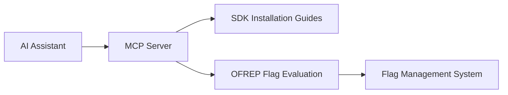

# Model Context Protocol (MCP)

The **OpenFeature Model Context Protocol (MCP) Server** enables AI coding assistants to interact with OpenFeature through a standardized protocol. It provides SDK installation guidance and feature flag evaluation capabilities directly within your AI-powered development environment.

:::info Active Development
This project is in active development. Features and APIs may change.
:::

## Overview

The OpenFeature MCP Server is a local tool that connects AI coding assistants (like Cursor, Claude Desktop, VS Code Continue, and Windsurf) to OpenFeature functionality. It acts as a bridge between your AI assistant and OpenFeature capabilities, enabling intelligent code generation, SDK installation guidance, and feature flag evaluation—all through natural language interactions.

### Key Benefits

- **AI-Assisted Development**: Get contextual OpenFeature SDK installation instructions directly in your coding environment
- **Intelligent Code Generation**: AI assistants can generate OpenFeature integration code with proper provider setup
- **Feature Flag Evaluation**: Evaluate feature flags via OFREP without leaving your development workflow
- **Multi-Language Support**: Works with OpenFeature SDKs across multiple languages and frameworks
- **Standardized Integration**: Uses the Model Context Protocol for consistent AI assistant integration

## What is MCP?

MCP (Model Context Protocol) is a standardized protocol that enables AI assistants to access external tools and data sources. The OpenFeature MCP Server implements this protocol to provide:

1. **SDK Installation Prompts**: Contextual guidance for installing and configuring OpenFeature SDKs
2. **OFREP Integration**: Remote flag evaluation capabilities through the OpenFeature Remote Evaluation Protocol
3. **Provider Documentation**: Installation instructions for popular feature flag providers

### How It Works



1. Your AI assistant connects to the OpenFeature MCP Server via stdio
2. When you ask about OpenFeature, the AI uses MCP tools to fetch relevant information
3. For flag evaluation, the server connects to your flag management system via OFREP
4. The AI assistant provides intelligent responses with accurate, up-to-date information

## Installation

### Quick Start

The easiest way to use the OpenFeature MCP Server is through NPX, which requires no installation:

```json
{
  "mcpServers": {
    "OpenFeature": {
      "command": "npx",
      "args": ["-y", "@openfeature/mcp"]
    }
  }
}
```

### Global Installation

For faster startup times, you can install the MCP server globally:

```bash
npm install -g @openfeature/mcp
```

Then configure your AI assistant to use the global installation:

```json
{
  "mcpServers": {
    "OpenFeature": {
      "command": "openfeature-mcp"
    }
  }
}
```

## Configuration

### AI Assistant Setup

#### Cursor

Add to `~/.cursor/mcp_settings.json`:

```json
{
  "mcpServers": {
    "OpenFeature": {
      "command": "npx",
      "args": ["-y", "@openfeature/mcp"]
    }
  }
}
```

#### VS Code (Continue)

Add to `.continue/config.json`:

```json
{
  "mcpServers": {
    "OpenFeature": {
      "command": "npx",
      "args": ["-y", "@openfeature/mcp"]
    }
  }
}
```

#### Claude Code (CLI)

Add the server via CLI:

```bash
claude mcp add --transport stdio openfeature npx -y @openfeature/mcp
```

Then manage the connection with `/mcp` in the CLI.

#### Windsurf

In the "Manage MCP servers" raw config, add:

```json
{
  "mcpServers": {
    "OpenFeature": {
      "command": "npx",
      "args": ["-y", "@openfeature/mcp"]
    }
  }
}
```

#### Claude Desktop

Edit your Claude Desktop config at:
- **macOS**: `~/Library/Application Support/Claude/claude_desktop_config.json`
- **Windows**: `%APPDATA%\Claude\claude_desktop_config.json`

Add the following configuration:

```json
{
  "mcpServers": {
    "openfeature": {
      "command": "npx",
      "args": ["-y", "@openfeature/mcp"]
    }
  }
}
```

Restart Claude Desktop after saving.

### OFREP Configuration

To use OFREP flag evaluation features, configure authentication and endpoint details. The server checks configuration in this priority order:

1. **Environment Variables**
   - `OPENFEATURE_OFREP_BASE_URL` or `OFREP_BASE_URL`
   - `OPENFEATURE_OFREP_BEARER_TOKEN` or `OFREP_BEARER_TOKEN`
   - `OPENFEATURE_OFREP_API_KEY` or `OFREP_API_KEY`

2. **Configuration File**: `~/.openfeature-mcp.json`

```json
{
  "OFREP": {
    "baseUrl": "https://flags.example.com",
    "bearerToken": "<your-token>",
    "apiKey": "<your-api-key>"
  }
}
```

You can override the config file path using the `OPENFEATURE_MCP_CONFIG_PATH` environment variable.

## Available Tools

The OpenFeature MCP Server provides two main tools accessible to AI assistants:

### 1. SDK Installation Guide

**Tool Name**: `install_openfeature_sdk`

Fetches comprehensive installation instructions for OpenFeature SDKs in various languages and frameworks. Optionally includes provider-specific setup guidance.

#### Parameters

| Parameter | Type | Required | Description |
|-----------|------|----------|-------------|
| `technology` | string | Yes | Target language/framework (see supported list below) |
| `providers` | string[] | No | Provider identifiers to include installation instructions |

#### Supported Technologies

- `android` - Android SDK
- `dotnet` - .NET SDK
- `go` - Go SDK
- `ios` - iOS/Swift SDK
- `java` - Java SDK
- `javascript` - JavaScript SDK
- `nestjs` - NestJS SDK
- `nodejs` - Node.js SDK
- `php` - PHP SDK
- `python` - Python SDK
- `react` - React SDK
- `ruby` - Ruby SDK

#### Supported Providers

The provider list is automatically sourced from the OpenFeature ecosystem. Popular providers include:

- `flagd` - OpenFeature reference implementation
- `launchdarkly` - LaunchDarkly provider
- `split` - Split.io provider
- `cloudbees` - CloudBees Feature Management
- `configcat` - ConfigCat provider
- And many more in the [OpenFeature ecosystem](/ecosystem)

#### Example Usage

When interacting with your AI assistant:

> "How do I install the OpenFeature SDK for Node.js with the flagd provider?"

The AI will use this tool to fetch relevant installation instructions and provide you with step-by-step guidance.

### 2. OFREP Flag Evaluation

**Tool Name**: `ofrep_flag_eval`

Evaluate feature flags using the OpenFeature Remote Evaluation Protocol. Supports both single flag and bulk evaluation.

#### Parameters

| Parameter | Type | Required | Description |
|-----------|------|----------|-------------|
| `base_url` | string | No | Base URL of your OFREP-compatible flag service |
| `flag_key` | string | No | Flag key for single evaluation (omit for bulk) |
| `context` | object | No | Evaluation context (e.g., `{ targetingKey: "user-123" }`) |
| `etag` | string | No | ETag for bulk evaluation caching |
| `auth` | object | No | Authentication configuration |
| `auth.bearer_token` | string | No | Bearer token for authorization |
| `auth.api_key` | string | No | API key for authorization |

#### API Endpoints

**Single Flag Evaluation**:
```
POST /ofrep/v1/evaluate/flags/{flagKey}
```

**Bulk Evaluation**:
```
POST /ofrep/v1/evaluate/flags
```

#### Example Usage

When interacting with your AI assistant:

> "Can you check the value of the 'new-checkout-flow' feature flag for user-123?"

The AI will use this tool to evaluate the flag and provide you with the result, along with additional metadata like variant and reason.

For more information about OFREP, see the [OFREP documentation](/docs/reference/other-technologies/ofrep).

## Examples

### Getting SDK Installation Help

```
You: How do I get started with OpenFeature in a React application?

AI: Let me help you install the OpenFeature React SDK...
[The AI fetches installation instructions using the MCP server]

Here's how to get started:

1. Install the package:
   npm install @openfeature/react-sdk

2. Import and configure...
```

### Evaluating Feature Flags

```
You: What's the current value of the 'dark-mode' flag?

AI: Let me check the current flag value...
[The AI evaluates the flag using OFREP through the MCP server]

The 'dark-mode' flag is currently:
- Value: true
- Variant: on
- Reason: TARGETING_MATCH
```

### Multi-Provider Setup

```
You: Show me how to set up OpenFeature with LaunchDarkly in TypeScript

AI: Here's how to integrate OpenFeature with LaunchDarkly...
[The AI fetches both OpenFeature and LaunchDarkly provider setup]

First, install the dependencies:
npm install @openfeature/server-sdk @launchdarkly/openfeature-node-server

Then configure the provider...
```

## Use Cases

### 1. Learning OpenFeature

AI assistants can provide contextual, accurate guidance when learning OpenFeature:
- SDK installation steps
- Provider configuration examples
- Best practices for your specific language/framework

### 2. Rapid Prototyping

Quickly scaffold OpenFeature integrations:
- Generate boilerplate code
- Set up provider connections
- Implement evaluation patterns

### 3. Feature Flag Debugging

Check flag values and targeting without leaving your editor:
- Evaluate flags with different contexts
- Verify targeting rules
- Debug flag resolution issues

### 4. Migration Support

Get guidance when migrating between providers:
- Compare provider configurations
- Understand provider-specific features
- Generate migration code

## Resources

- **GitHub Repository**: [open-feature/mcp](https://github.com/open-feature/mcp)
- **NPM Package**: [@openfeature/mcp](https://www.npmjs.com/package/@openfeature/mcp)
- **MCP Registry**: [dev.openfeature/mcp](https://registry.modelcontextprotocol.io)
- **OFREP Documentation**: [OpenFeature Remote Evaluation Protocol](/docs/reference/other-technologies/ofrep)
- **OpenFeature CLI**: [CLI Documentation](/docs/reference/other-technologies/cli)
- **CNCF Slack**: Join [#openfeature](https://cloud-native.slack.com/archives/C0344AANLA1)

## Get Involved

The OpenFeature MCP Server is an open-source project maintained by the OpenFeature community. We welcome contributions:

- **Report Issues**: [GitHub Issues](https://github.com/open-feature/mcp/issues)
- **Contribute Code**: [Contributing Guide](https://github.com/open-feature/mcp/blob/main/CONTRIBUTING.md)
- **Suggest Features**: Share ideas in the CNCF Slack [#openfeature](https://cloud-native.slack.com/archives/C0344AANLA1) channel
- **Improve Documentation**: Help us improve SDK installation guides and examples

Join the [CNCF Slack](https://communityinviter.com/apps/cloud-native/cncf) to get involved.
