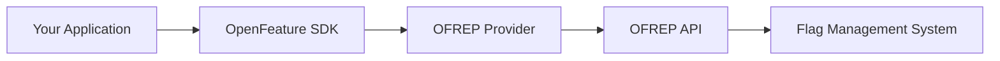

# OpenFeature Remote Evaluation Protocol (OFREP)

The **OpenFeature Remote Evaluation Protocol (OFREP)** is an API specification for feature flagging that enables vendor-agnostic communication between applications and flag management systems. 
OFREP allows the use of generic providers to connect to any feature flag management system that supports the protocol.

## Overview

The primary goal of OFREP is to establish a standardized, vendor-agnostic communication layer for feature flag evaluation. This protocol aims to decouple applications from specific feature flag vendors, fostering a more flexible and interoperable ecosystem.

At its heart, OFREP defines a standard API layer between the provider and the flag management system, allowing OpenSource and commercial feature flag management systems to implement the protocol and be compatible with the community-maintained providers. It enables out-of-the-box compatibility with any OFREP compliant flag management system, regardless of whether they have a specific OpenFeature provider implementation.

### Key Benefits

- **Vendor Agnostic**: Connect to any OFREP-compliant flag management system without vendor-specific implementations
- **Standardized**: Built on a common OpenAPI specification for consistent integration
- **Flexible**: Works on both client-side and server-side applications
- **Community Maintained**: Generic OFREP providers maintained by the OpenFeature community
- **Simple Migration**: Switch between flag management systems without changing application code

## What is OFREP?

OFREP is **a protocol, not a provider**. It defines how to communicate with feature flag management systems and works on top of OpenFeature SDKs by providing standardized providers that can be used to connect to any OFREP compliant flag management system.

### How It Works



1. Your application uses the OpenFeature SDK
2. The OpenFeature SDK uses an OFREP provider
3. The OFREP provider communicates with your flag management system via the standardized OFREP API
4. Your flag management system implements the OFREP specification

### Server vs Client

OFREP supports both paradigms defined by OpenFeature:

#### Server-Side (Dynamic Context)

- Evaluation happens by calling the OFREP API with context
- No in-process evaluation inside OFREP providers
- Context changes frequently (per request, per user)
- Follows the [dynamic-context paradigm](/docs/reference/concepts/sdk-paradigms#dynamic-context-paradigm-server-side-sdks)

#### Client-Side (Static Context)

- Evaluation happens locally with pre-fetched flag data
- Provider reconciles state when context changes
- Context represents a single user or session
- Follows the [static-context paradigm](/docs/reference/concepts/sdk-paradigms#static-context-paradigms-client-side-sdks)

## Using OFREP

### Available Providers

The OpenFeature community maintains OFREP providers for multiple languages. View the complete list of [OFREP providers in the ecosystem](/ecosystem/?instant_search%5BrefinementList%5D%5Bvendor%5D%5B0%5D=OFREP).

Common implementations include:
- TypeScript/JavaScript (Server & Web)
- Go
- Java
- .NET
- Python
- PHP

### Available Flag Management Systems

Many flag management systems support OFREP. View the complete list of [OFREP-compliant systems in the ecosystem](/ecosystem/?instant_search%5BrefinementList%5D%5Btype%5D%5B0%5D=OFREP%20API).

### Basic Usage

import Tabs from '@theme/Tabs';
import TabItem from '@theme/TabItem';

<Tabs groupId="code">
<TabItem value="js" label="TypeScript">

```ts
import { OpenFeature } from '@openfeature/server-sdk';
import { OFREPProvider } from '@openfeature/ofrep-provider';

// Configure the OFREP provider with your flag service endpoint
const provider = new OFREPProvider({
  baseURL: 'https://your-flag-service.example.com',
  headers: {
    'Authorization': 'Bearer your-api-token'
  }
});

// Set the provider
await OpenFeature.setProviderAndWait(provider);

// Get a client and evaluate flags
const client = OpenFeature.getClient();
const value = await client.getBooleanValue('new-feature', false, {
  targetingKey: 'user-123',
  email: 'user@example.com'
});
```

</TabItem>
<TabItem value="go" label="Go">

```go
import (
    "context"
    openfeature "github.com/open-feature/go-sdk/openfeature"
    ofrep "github.com/open-feature/go-sdk-contrib/providers/ofrep/pkg"
)

// Configure the OFREP provider
provider := ofrep.NewProvider(ofrep.ProviderConfig{
    BaseURL: "https://your-flag-service.example.com",
    Headers: map[string]string{
        "Authorization": "Bearer your-api-token",
    },
})

// Set the provider
openfeature.SetProvider(provider)

// Get a client and evaluate flags
client := openfeature.NewClient("my-app")
value, err := client.BooleanValue(
    context.Background(),
    "new-feature",
    false,
    openfeature.NewEvaluationContext("user-123", map[string]interface{}{
        "email": "user@example.com",
    }),
)
```

</TabItem>
<TabItem value="python" label="Python">

```python
from openfeature import api
from openfeature.contrib.provider.ofrep import OFREPProvider

# Configure the OFREP provider
provider = OFREPProvider(
    base_url="https://your-flag-service.example.com",
    headers={
        "Authorization": "Bearer your-api-token"
    }
)

# Set the provider
api.set_provider(provider)

# Get a client and evaluate flags
client = api.get_client()
value = client.get_boolean_value(
    "new-feature",
    False,
    {"targetingKey": "user-123", "email": "user@example.com"}
)
```

</TabItem>
</Tabs>

## Configuration

### Required Options

All OFREP providers accept these configuration options:

| Option | Description | Required |
|--------|-------------|----------|
| `baseURL` | The base URL of your flag management system (before `/ofrep/v1`) | Yes |
| `headers` | Headers to include in requests (e.g., authorization tokens) | No |
| `timeout` | Request timeout duration (default: 10 seconds) | No |

#### Example Configuration

```typescript
const provider = new OFREPProvider({
  // Base URL of your flag service
  baseURL: 'https://flags.example.com',
  
  // Authentication and custom headers
  headers: {
    'Authorization': 'Bearer token123',
    'X-Custom-Header': 'value'
  },
  
  // Request timeout (milliseconds)
  timeout: 5000
});
```

## API Specification

OFREP is defined by an [OpenAPI specification](https://github.com/open-feature/protocol/blob/main/service/openapi.yaml) that flag management systems must implement.

### Key Endpoints

#### Bulk Evaluation (Client-Side)

```
POST /ofrep/v1/evaluate/flags
```

Returns all flag values for a given context. Used by client-side providers.

**Request:**
```json
{
  "context": {
    "targetingKey": "user-123",
    "email": "user@example.com"
  }
}
```

#### Single Flag Evaluation (Server-Side)

```
POST /ofrep/v1/evaluate/flags/{flagKey}
```

Evaluates a single flag for a given context. Used by server-side providers.

**Request:**
```json
{
  "context": {
    "targetingKey": "user-123",
    "email": "user@example.com"
  }
}
```

**Response:**
```json
{
  "key": "new-feature",
  "value": true,
  "reason": "TARGETING_MATCH",
  "variant": "on",
  "metadata": {}
}
```

### Response Codes

| Code | Description | Provider Behavior |
|------|-------------|-------------------|
| `200` | Success | Return evaluation result |
| `400` | Bad request | Return error with details |
| `401`/`403` | Unauthorized | Return authorization error |
| `404` | Flag not found | Return `FLAG_NOT_FOUND` error |
| `429` | Rate limit exceeded | Respect `Retry-After` header |

## Implementing OFREP

### For Application Developers

If you're building an application and want to use OFREP:

1. Choose an [OFREP provider](/ecosystem/?instant_search%5BrefinementList%5D%5Bvendor%5D%5B0%5D=OFREP) for your language
2. Choose an [OFREP-compliant flag management system](/ecosystem/?instant_search%5BrefinementList%5D%5Btype%5D%5B0%5D=OFREP%20API)
3. Configure your provider with the flag system's OFREP endpoint
4. Start evaluating flags through the OpenFeature SDK

### For Provider Developers

To create an OFREP provider for a new language:

1. Review the [server provider guideline](https://github.com/open-feature/protocol/blob/main/guideline/dynamic-context-provider.md) or [client provider guideline](https://github.com/open-feature/protocol/blob/main/guideline/static-context-provider.md)
2. Implement the provider interface for your SDK
3. Add HTTP client logic to call OFREP endpoints
4. Handle error cases and response codes according to the specification
5. Register your provider in the [OpenFeature ecosystem](https://github.com/open-feature/openfeature.dev/issues)

### For Flag Management System Developers

To make your flag management system OFREP-compliant:

1. Implement the [OFREP OpenAPI specification](https://github.com/open-feature/protocol/blob/main/service/openapi.yaml)
2. Expose OFREP endpoints at `/ofrep/v1/evaluate/...`
3. Support both bulk evaluation (for client-side) and single flag evaluation (for server-side)
4. Test your implementation with existing OFREP providers
5. Register your system in the [OpenFeature ecosystem](https://github.com/open-feature/openfeature.dev/issues)

## Examples

### Switching Between Providers

One of the key benefits of OFREP is vendor portability. Switching flag systems only requires updating the provider configuration:

```typescript
// Before: Using Vendor A
const providerA = new OFREPProvider({
  baseURL: 'https://vendor-a.example.com',
  headers: { 'Authorization': 'Bearer token-a' }
});

// After: Using Vendor B (same application code!)
const providerB = new OFREPProvider({
  baseURL: 'https://vendor-b.example.com',
  headers: { 'Authorization': 'Bearer token-b' }
});
```

### Testing with a Local OFREP Server

```bash
# Run a local OFREP-compliant server
docker run -p 8080:8080 your-ofrep-server

# Configure your provider to use it
const provider = new OFREPProvider({
  baseURL: 'http://localhost:8080'
});
```

### Advanced Context Evaluation

```typescript
const client = OpenFeature.getClient();

// Rich evaluation context for targeting
const context = {
  targetingKey: 'user-123',
  email: 'user@example.com',
  country: 'US',
  subscription: 'premium',
  customData: {
    accountAge: 365,
    lastLogin: '2025-10-24T10:00:00Z'
  }
};

const value = await client.getBooleanValue('premium-feature', false, context);
```

## Resources

- **GitHub Repository**: [open-feature/protocol](https://github.com/open-feature/protocol)
- **OpenAPI Specification**: [OFREP OpenAPI Spec](https://github.com/open-feature/protocol/blob/main/service/openapi.yaml)
- **Provider Guidelines**:
  - [Server Provider Guide](https://github.com/open-feature/protocol/blob/main/guideline/dynamic-context-provider.md)
  - [Client Provider Guide](https://github.com/open-feature/protocol/blob/main/guideline/static-context-provider.md)
- **CNCF Slack**: Join the conversation in [#openfeature-remote-evaluation-protocol](https://cloud-native.slack.com/archives/C066A48LK35)
- **Specification**: [Appendix C: OFREP](/specification/appendix-c)
- **Ecosystem**: 
  - [OFREP Providers](/ecosystem/?instant_search%5BrefinementList%5D%5Bvendor%5D%5B0%5D=OFREP)
  - [OFREP-Compliant Systems](/ecosystem/?instant_search%5BrefinementList%5D%5Btype%5D%5B0%5D=OFREP%20API)

## Get Involved

OFREP is an open standard maintained by the OpenFeature community. We welcome contributions:

- **Implement OFREP** in your flag management system
- **Create providers** for additional languages
- **Provide feedback** on the specification
- **Share your experience** using OFREP

Join the [`#openfeature-remote-evaluation-protocol`](https://cloud-native.slack.com/archives/C066A48LK35) channel on the [CNCF Slack](https://communityinviter.com/apps/cloud-native/cncf) to get involved.
