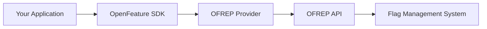

The **OpenFeature Remote Evaluation Protocol (OFREP)** is an API specification for feature flagging that enables vendor-agnostic communication between applications and flag management systems. It defines a standard API layer between the provider and the flag management system, allowing any OpenSource or commercial system to implement the protocol and be compatible with community-maintained providers.

### Key Benefits

- **Vendor Agnostic**: Connect to any OFREP-compliant flag management system without vendor-specific implementations
- **Standardized**: Built on a common OpenAPI specification for consistent integration
- **Flexible**: Works on both client-side and server-side applications
- **Community Maintained**: Generic OFREP providers maintained by the OpenFeature project

## How It Works

OFREP is **a protocol, not a provider**. It defines how to communicate with feature flag management systems and works on top of OpenFeature SDKs by providing standardized providers.

1. Your application uses the OpenFeature SDK
2. The OpenFeature SDK uses an OFREP provider
3. The OFREP provider communicates with your flag management system via the standardized OFREP API
4. Your flag management system implements the OFREP specification

### Server vs Client

OFREP supports both paradigms defined by OpenFeature:

#### Server-Side (Dynamic Context)

- Evaluation happens by calling the OFREP API with context
- API request with evaluation context is made on every evaluation
- Context per evaluation

#### Client-Side (Static Context)

- All flags are evaluated in one OFREP API call using a common static context
- Then local flag evaluation happens against the cached static context
- Context represents a single user or session

## Using OFREP

### Available Providers

The OpenFeature community maintains OFREP providers for multiple languages. View the complete list of [OFREP providers in the ecosystem](https://openfeature.dev/ecosystem/?instant_search%5BrefinementList%5D%5Bvendor%5D%5B0%5D=OFREP).

### Available Flag Management Systems

Several flag management systems support OFREP. View the complete list of [OFREP-compliant systems in the ecosystem](https://openfeature.dev/ecosystem/?instant_search%5BrefinementList%5D%5Btype%5D%5B0%5D=OFREP%20API).

## Implementing OFREP

### For Provider Developers

To create an OFREP provider for a new language:

1. Review the [server provider guideline](https://github.com/open-feature/protocol/blob/docs-update-readme-for-website/guideline/dynamic-context-provider.md) or [client provider guideline](https://github.com/open-feature/protocol/blob/docs-update-readme-for-website/guideline/static-context-provider.md)
2. Implement the provider for your SDK according to the guidelines
3. Register your provider in the [OpenFeature ecosystem](https://github.com/open-feature/openfeature.dev/issues)

### For Flag Management System Developers

To make your flag management system OFREP-compliant:

1. Implement the [OFREP OpenAPI specification](https://github.com/open-feature/protocol/blob/docs-update-readme-for-website/service/openapi.yaml)
2. Test your implementation with existing OFREP providers
3. Register your system in the [OpenFeature ecosystem](https://github.com/open-feature/openfeature.dev/issues)

