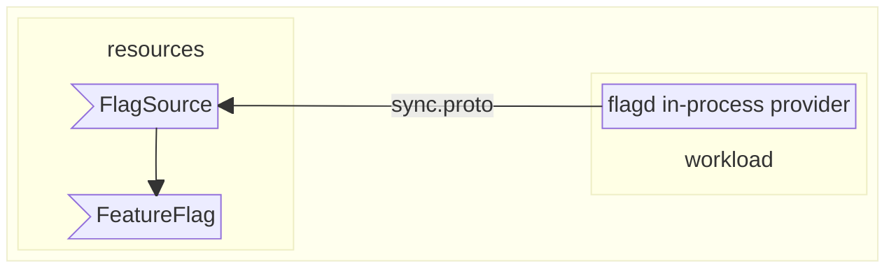
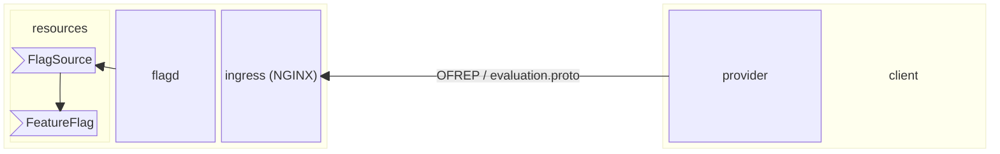

# In-Process and Client-side Evaluation with flagd and OpenFeature Operator

This tutorial outlines some of the advanced features and configurations supported by the OpenFeature operator and flagd.
The example configurations featured here make use of flagd used in a "standalone" mode; deployed and accessible centrally in your cluster (as opposed to injected into the workload as a sidecar).
The model adds some complexity in the configuration, but carries a few benefits:

- Centralized flagd deployments work well in conjunction with [in-process evaluation](https://flagd.dev/architecture/#in-process-evaluation), which speeds up feature-flag evaluation by performing flag evaluation directly in your application.
- Centralized flagd deployments are ideal for supporting [client-side](https://openfeature.dev/specification/glossary#client-side-sdk) evaluation (allowing web or mobile client applications to evaluate feature flags).

<p style={{fontSize:"x-large"}}>Enough talk, let's go!</p>

With that intro out of the way, let's get our hands dirty!

## Prerequisites

- We recommend you understand the [OFO quick start tutorial](./quick-start.md) first.
- We'll also need the following tools:
  - [kind](https://kind.sigs.k8s.io/docs/user/quick-start/#installation):  a tool for running local Kubernetes clusters using Docker container “nodes”
  - [kubectl](https://kubernetes.io/docs/tasks/tools/)
  - [k9s](https://k9scli.io/) (optional, if you'd like to inspect your cluster visually)
  - [helm](https://helm.sh/) (optional, if you prefer to install the operator using the Helm chart)

> [!IMPORTANT]  
> If you are using Kubernetes on Rancher Desktop, *you must temporarily disable `Traefik`* for this demo.
> See below for details and instructions.

### Rancher Desktop configuration

<details>
<summary>Disable Traefik in Rancher Desktop</summary>

Rancher Desktop uses K3s under the hood, which in turn uses Traefik as the default ingress controller for your Kubernetes cluster.
We need to use NGINX for this demo, which requires us to disable Traefik.
**Uncheck `Enable Traefik`** from the Kubernetes Settings page.
You may need to exit and restart Rancher Desktop for the change to take effect.


See [Rancher docs](https://docs.rancherdesktop.io/how-to-guides/setup-NGINX-Ingress-Controller/) for more information.

</details>

## Show me the commands

### Building our cluster

<details open>
<summary>Cluster Setup and Configuration</summary>

OK, let's get our cluster up and running!
We strongly recommend using `kind` for this demo, but if you already have a K8s cluster, you can skip to [Install cert-manager](#install-cert-manager).

> [!NOTE]  
> If not using kind, you will have to handle forwarding ports and exposing ingresses as appropriate for your distribution or infrastructure.

### Using Kind

Download the cluster definition file, `kind-cluster-advanced-topics.yaml`:

```shell
curl -sfL curl -sfL https://raw.githubusercontent.com/open-feature/openfeature.dev/main/static/samples/kind-cluster-advanced-topics.yaml > kind-cluster-advanced-topics.yaml
```

Then, create our cluster using the `kind-cluster-advanced-topics.yaml` file:

```shell
kind create cluster --config kind-cluster-advanced-topics.yaml
```

This might take a minute or two.
While the cluster is starting up, we can take a moment to look at the cluster definition.
Open `kind-cluster-advanced-topics.yaml` and take note that we expose port 80, and also supply a `kubeadmConfigPatch` which enables ingress usage with `kind`.

### Install cert-manager

Next, because our operator makes use of webhooks, we need some certificate infrastructure in our cluster.
If your cluster already has cert manager, or you're using another solution for certificate management, you can go to [Install OpenFeature operator](#install-openfeature-operator).

Install cert-manager, and wait for it to be ready:

```shell
kubectl apply -f https://github.com/cert-manager/cert-manager/releases/download/v1.13.2/cert-manager.yaml && \
kubectl wait --timeout=60s --for condition=Available=True deploy --all -n 'cert-manager'
```

## Install NGINX controller

For our NGINX ingress to work with `kind`, we need to install some additional components:

Download our NGINX controller configuration customization:

```shell
curl -sfL curl -sfL https://raw.githubusercontent.com/open-feature/openfeature.dev/main/static/samples/nginx-config.yaml > nginx-config.yaml
```

Install the NGINX controller:

```shell
kubectl apply -f https://raw.githubusercontent.com/kubernetes/ingress-nginx/main/deploy/static/provider/kind/deploy.yaml
kubectl apply -f nginx-config.yaml
kubectl wait --timeout=60s --for condition=Available=True deploy --all -n 'ingress-nginx'
```

This manifest contains kind-specific patches to forward the hostPorts to the ingress controller, set taint tolerations and schedule it to the custom labelled node.

### Install OpenFeature operator

And finally, let's install the operator itself:

<details>
  <summary>Install using manifest</summary>

  ```shell
  kubectl apply -f https://github.com/open-feature/open-feature-operator/releases/download/v0.6.1/release.yaml && \
  kubectl wait --timeout=60s --for condition=Available=True deploy --all -n 'open-feature-operator-system'
  ```

</details>

<details>
  <summary>Install using Helm</summary>

  ```shell
  helm repo add openfeature https://open-feature.github.io/open-feature-operator/ && \
  helm repo update && \
  helm upgrade --install open-feature-operator openfeature/open-feature-operator
  ```

  > [!NOTE]  
  > When using Helm, various configuration parameters can be set, such as resource limits and default configuration values.
  > See the full [chart documentation](https://artifacthub.io/packages/helm/open-feature-operator/open-feature-operator#configuration) for details.

</details>

</details>

## In-process Evaluation

First, lets see how a centralized flagd can be used to serve flags to an *in-process* workload.

### Downloading and understanding the `in-process-evaluation.yaml` manifest

Download the file defining our demo deployment, service and custom resource (CRs), `in-process-evaluation.yaml`:

```shell
curl -sfL curl -sfL https://raw.githubusercontent.com/open-feature/playground/main/config/k8s/in-process-evaluation.yaml > in-process-evaluation.yaml
```

Let's take a look at the manifest and try to understand what's happening...
The `in-process-evaluation.yaml` manifest contains a few resources:

- A feature flag definition (`kind: FeatureFlag`), and a flag source (`kind: FeatureFlagSource`) (these should be familiar to you from the [quick start](quick-start.md)).
- A flagd definition (`kind: Flagd`) which defines a "standalone" flagd.
  - This flagd is available centrally and fronted by a `Service`, so that any workload can connect to it.
  - This can save resources compared to injected sidecars into every relevant workload.
- An in-process flagd provider configuration (`kind: InProcessConfiguration`) which configures our workload to evaluate feature flags in-process, after retrieving definitions from the centralized flagd instance.
  - Evaluating flags in process involves no network I/O or serialization, improving latency and overall performance.
- Our `Deployment`, with an annotation associating it with the in-process provider configuration (`openfeature.dev/inprocessconfiguration: 'in-process-config'`); this configures the flagd provider in the workload to use the in-process configuration.

### Apply the `in-process-evaluation.yaml` manifest

```shell
kubectl -n default apply -f in-process-evaluation.yaml && \
kubectl wait --timeout=60s deployment --for condition=Available=True -l 'app=open-feature-demo' -n 'default'
```

If you're using `k9s` or some other means of visualization, the pods your cluster should look something like this:


Take note of the `flagd-in-process` pod.

### Test the in-process configuration

Let's make sure everything is working as expected by changing the value of a backend flag.
Open your browser and navigate to [localhost](http://localhost).


> [!IMPORTANT]  
> If you see a 404 and you're using Rancher Desktop, you may have forgotten to [disable Traefik](#rancher-desktop-configuration).

Click the fibonacci calculator; it should take ~4000ms to return a value using the `"recursive"` algorithm.
Now, change the `defaultValue` of the `"fib-algo"` flag in our `in-process-evaluation.yaml` manifest from `"recursive"` to `"binet"`:

```yaml
  fib-algo:
    variants:
      recursive: recursive
      memo: memo
      loop: loop
      binet: binet
    #diff-remove
    defaultVariant: recursive
    #diff-add
    defaultVariant: binet
```

Apply the manifest again:

```shell
kubectl -n default apply -f in-process-evaluation.yaml && \
kubectl wait --timeout=60s deployment --for condition=Available=True -l 'app=open-feature-demo' -n 'default'
```

Now, if you run the fibonacci calculator again, it should take ~5ms to return a value.
We see our flag system is working!

### How does the in-process configuration work?



The `flagd-in-process` `Flagd` custom resource instance we defined starts up a flagd instance.
This instance is configured to use the `app-flags` flag definition through it's association with the `app-flag-source` `FeatureFlagSource`.
The operator automatically configures the `flagd-provider` in our workload to connect to the `flagd-in-process` flagd instance via inject environment variables.
The provider then uses the [sync.proto](https://buf.build/open-feature/flagd/file/main:flagd/sync/v1/sync.proto) to retrieve the flag definitions (as well as any subsequent updates) from flagd.

## Client-side evaluation

Now, lets see how a centralized flagd can be used to support client-side evaluation of feature flags in single-page application.

> [!IMPORTANT]  
> It's expected you've already completed the [Building our cluster](#building-our-cluster) section above.
> If you haven't, you can do that now before continuing.

### Downloading and understanding the `client-side-evaluation.yaml` manifest

Download the file defining our demo deployment, service and custom resource (CRs), `in-process-evaluation.yaml`:

```shell
curl -sfL curl -sfL https://raw.githubusercontent.com/open-feature/playground/main/config/k8s/client-side-evaluation.yaml > client-side-evaluation.yaml
```

Let's take a look at the manifest...
Similar to the in-process evaluation above, the `client-side-evaluation.yaml` manifest contains a few resources:

- A feature flag definition (`kind: FeatureFlag`), and a flag source (`kind: FeatureFlagSource`) (these should be familiar to you from the [quick start](quick-start.md)).
- A flagd definition (`kind: Flagd`) which defines a "standalone" flagd.
  - The flagd contains an `ingress` spec, which will be used to automatically generate an ingress and associated service to export our flags to the client application.
    - Note that the ingress spec contains reverse-proxy rules which will forward feature-flag requests to our flagd
- Our `Deployment`, which serves a React app using the `@openfeature/react-sdk`.

### Apply the `client-side-evaluation.yaml` manifest

```shell
kubectl -n default apply -f client-side-evaluation.yaml && \
kubectl wait --timeout=60s deployment --for condition=Available=True -l 'app=open-feature-demo' -n 'default'
```

If you're using `k9s` or some other means of visualization, the pods your cluster should look something like this:


Take note of the `flagd-ui` pod.

### Test the client-side configuration

Let's make sure everything is working as expected.
Open your browser and navigate to [localhost](http://localhost) (or refresh, if you're already there).


> [!IMPORTANT]  
> If you see a 404 and you're using Rancher Desktop, you may have forgotten to [disable Traefik](#rancher-desktop-configuration).

You should see the UI has a blue theme.
Now, change the `defaultValue` of the `"hex-color"` flag in our `client-side-evaluation.yaml` manifest from `"blue"` to `"red"`:

```yaml
  hex-color:
    variants:
      red: c05543
      green: 2f5230
      blue: 0d507b
      yellow: d4ac0d
    #diff-remove
    defaultVariant: blue
    #diff-add
    defaultVariant: red
    state: ENABLED
    targeting:
      if:
        - in:
            - '@faas.com'
            - var:
                - email
        - yellow
        - null
```

Apply the manifest again:

```shell
kubectl -n default apply -f client-side-evaluation.yaml && \
kubectl wait --timeout=60s deployment --for condition=Available=True -l 'app=open-feature-demo' -n 'default'
```

You should see the UI immediately change color!

### How does the client-side configuration work?

The `flagd-ui` `Flagd` custom resource instance we defined starts up a flagd instance.
This instance is configured to use the `ui-flags` flag definition through it's association with the `ui-flag-source` `FeatureFlagSource`.
The operator automatically configures an ingress and service which expose this `flagd` instance so it can be accessed outside your cluster.

The client app uses the [@openfeature/react-sdk](https://www.npmjs.com/package/@openfeature/react-sdk) to make use of either the [OFREP](https://openfeature.dev/specification/appendix-c/) or `flagd-web` providers to perform flag evaluations (you can switch this with the dropdown in the bottom right).
Both the providers support the emission of events when a flag configuration is changed (the `flagd-web` provider maintains a connection with flagd via the connect protocol, while the OFREP provider does HTTP polling).
When the providers emit this change event, the `@openfeature/react-sdk` causes the UI to re-render.
It's worth noting that these providers do not expose flag evaluation rules or flag configuration in general to the client; the client simply makes a "bulk evaluation" request and retrieves a set of evaluated flags.



## Cleaning up

If you used a kind cluster, you can clean everything up by running:

```shell
kind delete cluster
```

If you [disabled Traefik](#rancher-desktop-configuration), you may want to re-enable it.
